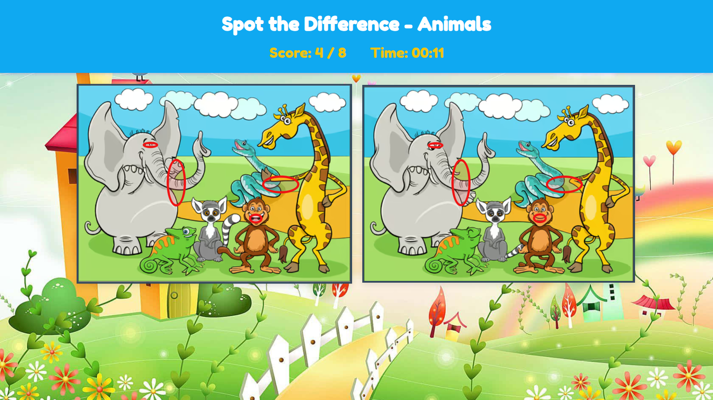

# JSON-Powered "Spot the Difference" Game

[](https://example.com)
[](https://opensource.org/licenses/MIT)

A responsive, lightweight "Spot the Difference" web application built with Vanilla JavaScript. The game's primary feature is its dynamic content engine, which populates all game data—including images and hotspot coordinates—from a single `game.json` configuration file.

**[View Live Demo](https://spot-the-difference-olive.vercel.app/)**

|                                                          |                                                          |
| :------------------------------------------------------: | :------------------------------------------------------: |
|  |  |

## 🚀 Features

- **Dynamic Content:** Game levels are 100% driven by `game.json`.
- **Click Detection:** Accurately identifies clicks within predefined "bounding boxes."
- **Interactive UI:** Includes a real-time score, game timer, and clear win-state message.
- **Audio Feedback:** Provides sound effects for successful actions.
- **Responsive Design:** Adapts for play on both desktop and mobile devices.

## 🛠️ Technology Stack

- **Frontend:** HTML5, CSS3 (Flexbox), Vanilla JavaScript (ES6+)
- **API/Data:** `fetch` API, JSON
- **Core Concepts:** DOM Manipulation, `async/await`, Event Handling, `setInterval`

---

## ⚙️ Getting Started

### Prerequisites

To run this project locally, you must serve the files from a local server. Opening `index.html` directly from the filesystem (`file:///`) will not work due to browser security restrictions on the `fetch()` API.

- [Node.js](https://nodejs.org/) (v16+)
- Any code editor (e.g., [VS Code](https://code.visualstudio.com/))

### Installation & Local Setup

1.  **Clone the repository:**

    ```bash
    git clone https://github.com/ras41/spot-the-difference.git
    cd spot-the-difference
    ```

2.  **Install a simple HTTP server:**

    ```bash
    npm install -g http-server
    ```

3.  **Run the server:**

    ```bash
    http-server -p 8080
    ```

4.  **Open the game:**
    Open your browser and navigate to `http://localhost:8080`

---

## 📋 How It Works: The `game.json` Architecture

This project is architected to separate **logic (JavaScript)** from **data (JSON)**.

### 1. Instructions to Run the Game

The game is initiated by `script.js`, which first loads `index.html`.

1.  The `initGame()` function is triggered on `DOMContentLoaded`.
2.  This `async` function uses `fetch` to retrieve `game.json`.
3.  Once fetched, the JSON is parsed into a JavaScript object.
4.  The `setupGame()` function uses this object to populate the UI (title, images, total score).
5.  A timer is started using `setInterval`.

### 2. Explanation of JSON Usage

The `game.json` file is the single source of truth for the game's content.

```json
{
  "gameTitle": "Spot the Difference - Animals",
  "images": {
    "image1": "images/image1.jpg",
    "image2": "images/image2.jpg"
  },
  "differences": [{ "id": 1, "x": 100, "y": 200, "width": 50, "height": 50 }]
}
```

- `gameTitle`: Sets the text of the `<h1>` element.
- `images`: Provides the `src` paths for the two `` elements.
- `differences`: This is an array of "hotspot" objects.
  - When a user clicks on an image wrapper, the `handleImageClick` event fires.
  - The script gets the click's `event.offsetX` and `event.offsetY`.
  - It then loops through the `differences` array, checking if the click coordinates fall within the **bounding box** defined by any `(x, y, width, height)` object.
  - If a match is found, the `markDifference` function uses the _same_ `(x, y, width, height)` data to dynamically create and position the visible circle marker on the screen.
